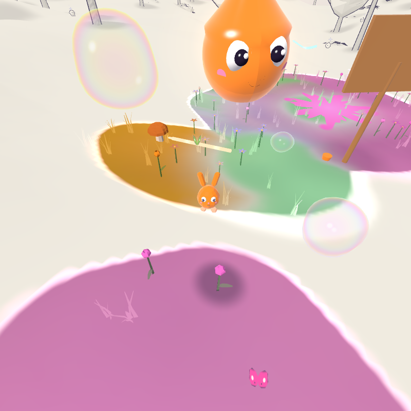
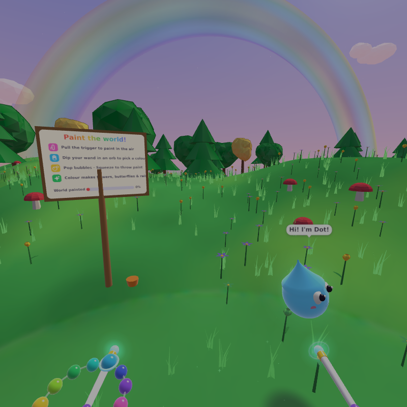
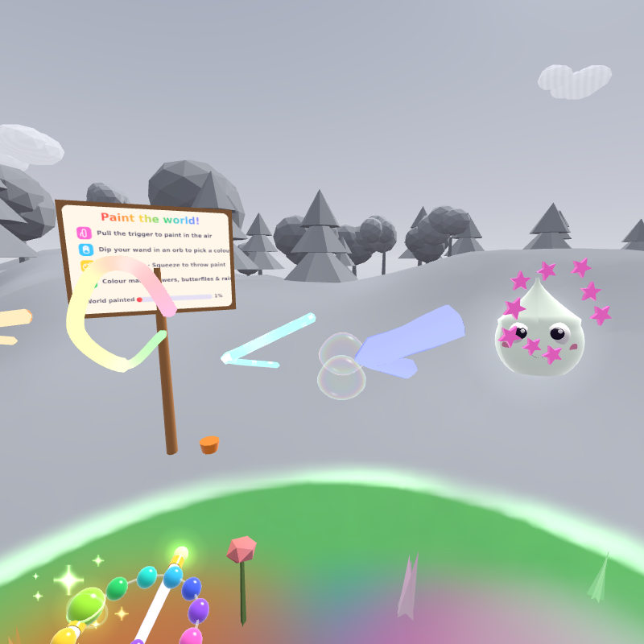
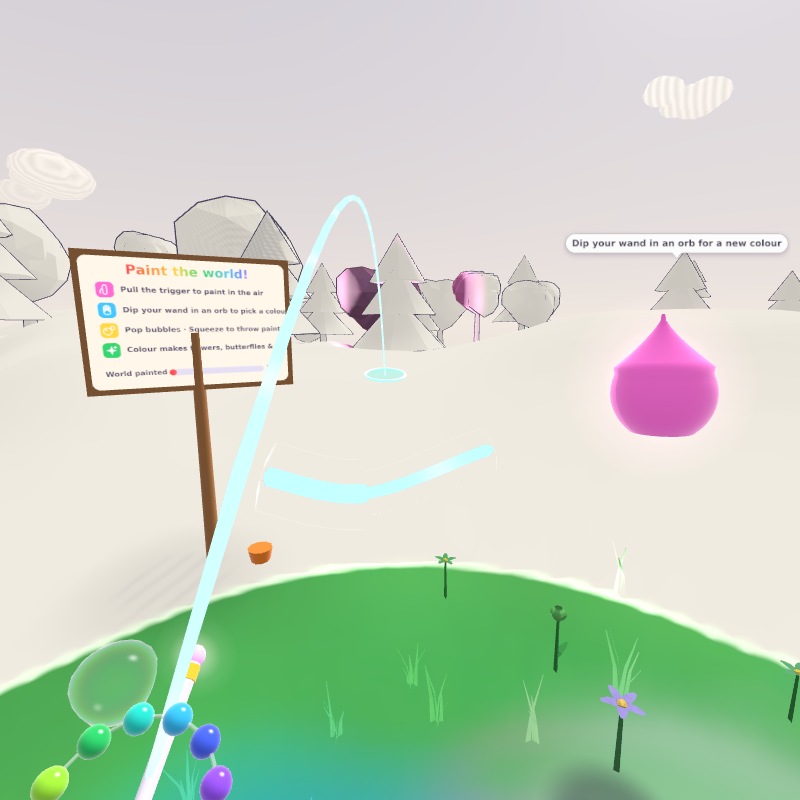
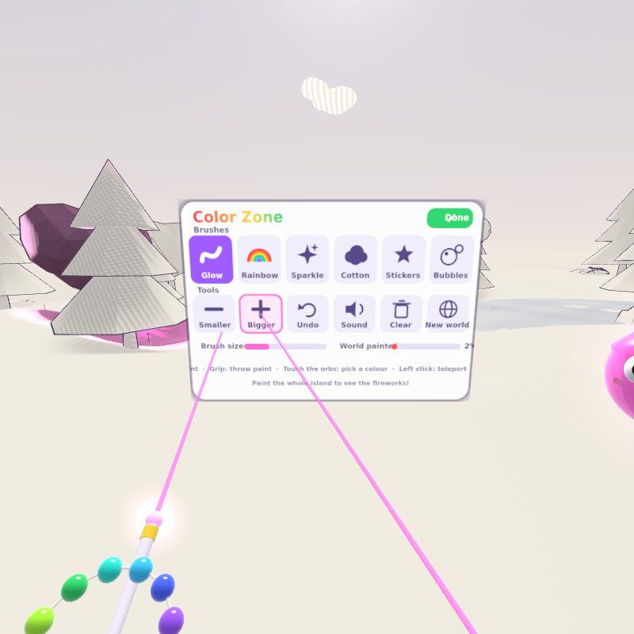

<p align="center">
  
</p>

<h1 align="center">Color Zone XR</h1>
<p align="center"><strong>Paint the world back to life.</strong><br/>
A joyful WebXR art playground for Meta Quest — no app store, no downloads, no assets to fetch. Open the link in the Quest browser and start painting.</p>

<p align="center">
  
</p>

## The idea

The title screen shows a little floating island in full colour. The moment you step in, Dot — a paint-drop with big eyes — says hello, and the colours drain away until the island is a pencil sketch on warm paper: ink outlines, cross-hatched shade, a grey pond. Only the patch of grass at your feet stays green. "Pull the trigger and paint them back!"

- **Paint in the air.** Pull the trigger and glowing neon ribbons (with a soft light halo) follow your hand. Every stroke drips colour onto the land below, and the island blooms around it: grass tufts, daisies, tulips and spotted mushrooms pop up with a sparkle, trees take on your colours, the pond turns blue and the fountain starts to shine.
- **Colour spreads while you play.** The more you paint, pop and throw, the faster colour bleeds outward across the hills. Stop, and the magic settles. Only *your* play counts: the world never paints itself while you stand still.
- **Pop bubbles, throw paint.** Bubbles rise from the flowers you've bloomed and drift over to you — poke them for confetti and a splash of colour. Squeeze the grip (or make a fist with hand tracking) to conjure a paint ball and hurl it: *splat*. Hold it a moment longer and it grows into a bigger splat.
- **Meet Dot.** A little paint-drop buddy floats at your side, cheers when you paint, takes on your colour, plays catch with you, and flies off to show you the next thing that needs colour.
- **Bring the whole world back.** Butterflies come with the first friend you wake and swarm at 25%. The rainbow grows in as you go. At 75% the sun starts smiling. Paint it all and the sky fills with fireworks.

## Things to do

The island is full of things that answer you. Nothing needs reading, nothing can fail, and every one of them uses the same four moves: paint, throw, poke, go.

<p align="center">
  
</p>

- **Wake the sleepyheads.** A dozen pencil-sketch animals doze around the island with little *zzz*s floating up — bunnies, frogs and birds. Paint over one (or splat it) and it colours in with *your* colour, pops awake with a stretch, and starts living: bunnies hop after you and sit at your feet, frogs hop to the pond and ribbit when you poke them, birds fly to painted trees and sing. Poking a sleeper only makes it twitch — it needs colour.
- **Follow Dot.** When you pause, Dot flies to the next thing worth colouring — a sleeper, a grey tree, the sketch pond — hovers over it with a pulsing beacon and calls you over. Finish it and the celebration happens right there: petals, confetti, a spin. Each wish reaches a little farther across the island.
- **Poke everything.** Sweep your wand through the meadow and flowers, grass and mushrooms boing under your hand with a puff of colour and a buzz in the controller. Trees shiver and shed petals, rocks *bonk*, the fountain clonks and blows a ring of bubbles, the signpost wobbles, and Dot squeaks "Boop!" and scoots away.
- **Play catch with Dot.** Throw a paint ball her way and she darts over, catches it ("Got it!") and lobs it gently back to your hand. Squeeze as it arrives to catch it. Every toss makes the ball bigger and brighter; miss, and it's still a glorious splat.
- **Feed the fountain.** Throw a ball into the pond: *kersploosh* — the whole pond takes the colour, the koi leap, and the stone fountain gushes higher and bubblier with every new colour you give it. Rest your wand on the water and the fish come to nibble your hand, then leap right through it, taking your colour with them.
- **Ride your strokes.** Paint a long swooping line and a tiny cousin of Dot hops on and rides it like a roller coaster — squealing down the dips, leaning into the bends — then flies off the end and splats colour wherever it lands. Poke a rider and it giggles.
- **Balls hit things.** Paint balls ricochet off rocks, bounce off mushroom caps, splat onto tree canopies (the tree takes the colour) and send a visible wave through the flowers.
- **Butterflies and travel.** Touch a butterfly and it poofs into colour; hold your wand perfectly still and one may land on the tip. Wherever you teleport, colour splashes at your feet, so exploring paints the far hills.

Everything is procedural: the island, plants, clouds, particles and every sound are generated in code, so the whole experience is ~1 MB and works offline as an installable app.

<p align="center">
  
  
  
</p>
<p align="center">
  
  
  
</p>

## Play it

**On a Meta Quest (2, 3, 3S, Pro):** open the published page in the Quest browser and press **Enter VR**. Once GitHub Pages is enabled for this repository (Settings → Pages → *GitHub Actions*), the `Deploy to GitHub Pages` workflow publishes `main` automatically.

**On a computer:** open the same page and press **Explore on desktop** — mouse look, WASD to walk, left mouse to paint, right mouse to throw paint.

**Locally, for development:**

```bash
npm install
npm start
```

That serves `http://localhost:8080` for the desktop preview and, if `openssl` is installed, `https://<your-LAN-IP>:8443` for the headset (WebXR requires HTTPS; accept the self-signed certificate warning once).

## Controls

| Action | Quest Touch controllers | Hand tracking | Desktop |
| --- | --- | --- | --- |
| Paint | Trigger (pressure = thickness) | Pinch index + thumb | Left mouse |
| Pick a colour | Dip the wand tip into an orb on the left controller, or flick the left stick | Touch an orb on the back of your left hand | `1`–`9`, `0`, `-`, `=` |
| Change brush | `B` | Menu | `Tab` |
| Brush size | Right stick up / down | Menu | Mouse wheel, `Q` / `E` |
| Throw a paint ball | Hold grip, swing, release | Make a fist, swing, open your hand | Right mouse |
| Catch a ball | Squeeze as it reaches your wand | Close your fist on it | Right mouse |
| Pop a bubble · poke things | Touch them with either wand | Touch them | Touch them with the wand |
| Undo | `A` or `Y` | Menu | `Z` |
| Menu | `X` | — | `M` |
| Teleport | Push left stick forward, aim, release | — | WASD to walk |
| Snap turn 30° | Flick right stick left / right | — | Mouse look |

The floating menu (point a wand's laser at a button and pull the trigger, or just poke it) has all six brushes, brush size, sound, undo, *Clear*, *New world*, which rolls a brand-new island, and *Exit*, which saves, leaves VR and shuts the app down completely (no sound, no rendering) until you press *Play again*.

## Brushes

| | Brush | What it does |
| --- | --- | --- |
| ✦ | **Glow** | A neon ribbon of light with a travelling pulse |
| 🌈 | **Rainbow** | The hue cycles along the stroke |
| ✨ | **Sparkle** | A thin twinkling thread that sheds stars |
| ☁ | **Cotton** | Puffy, wobbling cotton-candy clouds |
| ★ | **Stickers** | Stars and hearts scattered along your path |
| ○ | **Bubbles** | Blows bubbles you can pop later |

Paintings auto-save in the browser and are restored on the next visit. Add `?fresh` to the URL to start clean, or `?seed=anything` for a specific island.

## How it's built

Plain ES modules and [three.js](https://threejs.org) (vendored, no bundler), so the code you read is the code that runs.

```
src/
  App.js              frame loop, player rig, XR session, systems
  world/              procedural island: terrain, sky, flora, clouds, pond, rainbow
    WorldMaterial.js  one shader for the environment — samples the paint map and reveals colour
  paint/              PaintMap (top-down colour render target), strokes, brushes, palette, wand
  fx/                 GPU particle pool, bubbles, thrown paint + splat decals
  audio/              procedural Web Audio: brush whoosh, pops, splats, fanfares
  input/              Quest controllers + hand tracking, desktop fallback, locomotion
  creatures/          Dot the buddy, butterflies, the sleepyheads (Critters), pond koi (Fish), rail Riders
  play/               the things to do: Boops (poke anything), Catch (play catch with Dot), Pond (feed the fountain)
  systems/            Guide (Dot leads you to the next thing), milestones, auto-save
  ui/                 canvas-drawn menu, help sign, toasts
tools/
  serve.js            HTTPS dev server for the headset
  test/               headless Quest emulator + Playwright end-to-end test
```

A few of the tricks that make it feel good:

- **The paint map.** A 1024² render target seen from above. Strokes, drips, bubble pops and splats stamp soft circles of colour into it; every environment shader samples it to blend from sketch to colour, with a glowing "magic edge" at the boundary. A ping-pong pass lets colour bleed outward, driven by how actively you're playing.
- **The sketch look.** The same shader draws the unpainted world as a pencil illustration: warm paper, anti-aliased cross-hatching that only appears in shade, baked contact shadows (a second top-down map stamped once per island), and inverted-hull ink outlines on trees, rocks and props.
- **Blooming plants.** Thousands of instanced flowers, grass tufts and mushrooms start at scale zero and pop with an elastic bounce (in the vertex shader) when colour reaches them.
- **Silky strokes.** Tubes are extruded incrementally with parallel-transported frames, through a Catmull-Rom spline that lags one sample behind the hand, so fast scribbles stay smooth at any frame rate. Finished strokes are merged into batches to keep draw calls low.
- **GPU particles.** The CPU writes a particle's spawn state once; the shader integrates motion from time. Drips even know when they'll land so the ground splashes exactly on impact.
- **Sound that sits in the world.** The brush whooshes with your hand speed; pops, splats, blooms and the fountain are positioned in 3D around you. No background music, by design.

## Testing

```bash
npm test            # full run: desktop + emulated Quest, writes docs/screenshots
npm run test:quick  # skips the long milestone scenarios
npm run lint
```

`tools/test/xr-emulator.js` implements just enough of the WebXR API (session, stereo views, two Touch controllers with haptics, optional tracked hands with pinch and fist) for three.js to run a real immersive session in headless Chromium. The test plays through the whole experience — every brush, palette picks, undo, throwing, popping, teleporting, snap turns, the menu, milestones, the finale, hand-tracked pinch painting — and asserts on gameplay state. Each play feature has its own scenario in `tools/test/scenarios/` (waking a sleeper, Dot leading, poking the meadow, a rally of catch, feeding the fountain, a rider flying off a rail).

## Performance notes for Quest

- Draw calls stay in the dozens: instanced flora, batched strokes, single-mesh clouds and one particle pool per blend mode.
- No post-processing and no shadow maps; lighting is cheap hemisphere + sun toon shading inside the shaders. Fixed foveation is left at maximum and the session asks for 90 Hz where supported.
- Comfort first for kids: teleport with a soft blink and snap turns only, no smooth locomotion.

## License

MIT. three.js is © its authors and also MIT licensed (see `vendor/three/LICENSE`).
